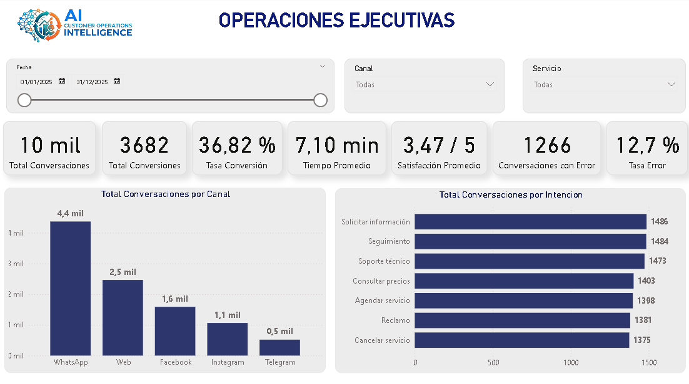
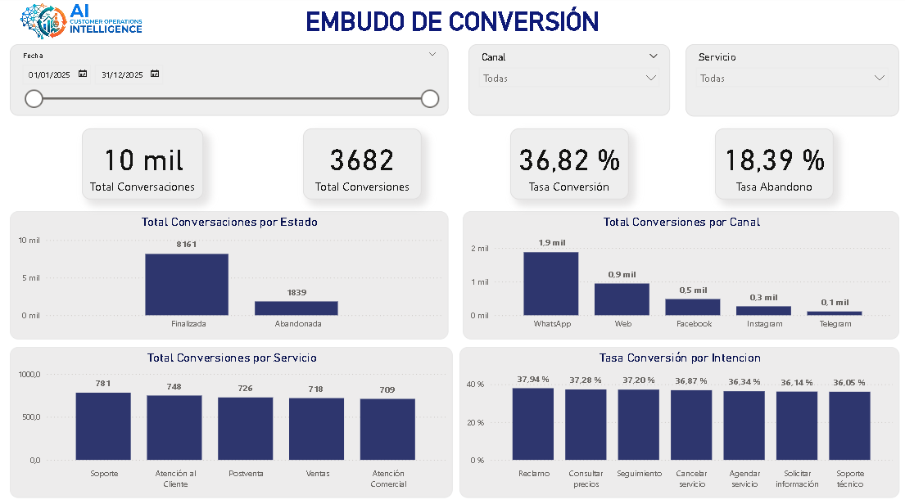
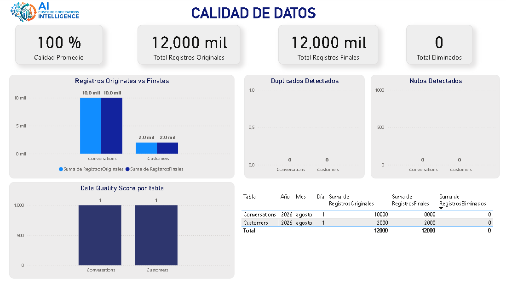
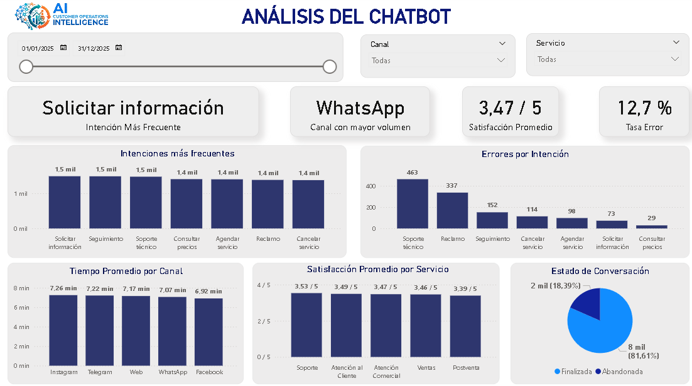

# AI_Customer_Operations_Intelligence

Solución integral de Business Intelligence para analizar las operaciones de atención al cliente realizadas mediante un chatbot empresarial.

El proyecto integra generación de datos sintéticos, un pipeline ETL en Python, un Data Warehouse en SQL Server, un dashboard ejecutivo en Power BI y un copiloto analítico desarrollado con Streamlit.

---

## Problema de negocio

Una empresa atiende clientes mediante diferentes canales digitales, como WhatsApp, Web, Facebook, Instagram y Telegram.

La gerencia necesita conocer:

* Cuántas conversaciones recibe la empresa.
* Qué canales generan más conversiones.
* Qué intenciones presentan más errores.
* Cuánto dura la atención.
* Cuántos clientes abandonan la conversación.
* Qué servicios obtienen mayor satisfacción.
* Qué tan confiables son los datos utilizados.
* Qué recomendaciones operativas pueden obtenerse a partir de los KPIs.

---

## Objetivo del proyecto

Diseñar una solución analítica de extremo a extremo que permita monitorear la atención al cliente, la conversión, el desempeño del chatbot y la calidad de los datos.

La solución busca demostrar conocimientos en:

* Diseño de soluciones BI.
* Modelado dimensional.
* SQL Server.
* Python y pandas.
* Desarrollo de pipelines ETL.
* Calidad de datos.
* Power BI y DAX.
* Streamlit.
* IA aplicada mediante respuestas controladas y consultas SQL trazables.

---

## Arquitectura de la solución

```text
Generador de datos sintéticos
            │
            ▼
        data/raw
            │
            ▼
    Pipeline ETL en Python
            │
     ┌──────┼────────┐
     ▼      ▼        ▼
 Extract Transform Quality
            │
            ▼
      data/processed
            │
            ▼
 Construcción del modelo estrella
            │
            ▼
       SQL Server
      Data Warehouse
            │
     ┌──────┴─────────────┐
     ▼                    ▼
 Power BI          Streamlit
 Dashboard         Copiloto analítico
```

---

## Tecnologías utilizadas

| Tecnología    | Aplicación                                      |
| ------------- | ----------------------------------------------- |
| Python        | Generación de datos, ETL y aplicación analítica |
| pandas        | Limpieza, transformación y preparación de datos |
| Faker         | Generación de clientes sintéticos               |
| SQL Server    | Almacenamiento del Data Warehouse               |
| pyodbc        | Conexión entre Python y SQL Server              |
| Power BI      | Visualización y análisis de KPIs                |
| DAX           | Creación de medidas y métricas de negocio       |
| Power Query   | Preparación de datos para visualización         |
| Streamlit     | Interfaz del copiloto analítico                 |
| python-dotenv | Gestión segura de variables de entorno          |
| Git y GitHub  | Control de versiones y publicación              |

---

## Modelo dimensional

El Data Warehouse utiliza un modelo estrella formado por una tabla de hechos y cinco dimensiones.

### Tabla de hechos

`FactConversaciones`

Contiene los eventos de atención al cliente y las métricas principales:

* Duración de la conversación.
* Estado de la conversación.
* Conversión.
* Errores del chatbot.
* Satisfacción.

### Dimensiones

* `DimCliente`
* `DimFecha`
* `DimCanal`
* `DimServicio`
* `DimIntencion`

```text
                    DimCliente
                         │
                         │
DimFecha ───── FactConversaciones ───── DimCanal
                         │
              ┌──────────┴──────────┐
              │                     │
        DimServicio           DimIntencion
```

---

## Pipeline ETL

El pipeline fue desarrollado utilizando una arquitectura modular.

### Extract

Lee los archivos almacenados en `data/raw` y valida que las fuentes existan.

### Transform

Aplica reglas de limpieza y estandarización:

* Eliminación de duplicados.
* Validación de edades.
* Tratamiento de valores nulos.
* Conversión de fechas.
* Normalización de textos.
* Validación de duraciones.

### Quality

Calcula métricas de calidad:

* Registros originales.
* Registros procesados.
* Registros eliminados.
* Valores nulos.
* Duplicados detectados.
* Data Quality Score.

### Load

Carga las dimensiones y la tabla de hechos en SQL Server mediante `pyodbc` y carga por lotes.

---

## Flujo de datos

```text
data/raw
   │
   ▼
extract.py
   │
   ▼
transform.py
   │
   ▼
quality.py
   │
   ▼
data/processed
   │
   ▼
build_dimensions.py
build_date_dimension.py
build_fact.py
   │
   ▼
data/warehouse
   │
   ▼
load.py
   │
   ▼
SQL Server
```

---

## Dashboard en Power BI

El dashboard está formado por cuatro páginas.

### 1. Resumen Ejecutivo

Permite revisar rápidamente:

* Conversaciones totales.
* Conversiones.
* Tasa de conversión.
* Tiempo promedio.
* Satisfacción promedio.
* Conversaciones con error.
* Tasa de error.
* Conversaciones por canal.
* Intenciones más frecuentes.



### 2. Análisis de Conversaciones y Conversión

Analiza:

* Conversaciones por estado.
* Conversión por canal.
* Conversión por servicio.
* Conversión por intención.
* Tasa de abandono.
* Tiempo promedio por estado.



### 3. Calidad de Datos

Monitorea la confiabilidad de la información procesada por el ETL:

* Registros evaluados.
* Valores nulos.
* Duplicados.
* Registros eliminados.
* Data Quality Score.
* Comparación de calidad entre fuentes.



### 4. Análisis del Chatbot

Permite identificar oportunidades de mejora:

* Intenciones más frecuentes.
* Errores por intención.
* Tiempo promedio por canal.
* Satisfacción por servicio.
* Estado de las conversaciones.
* Recomendaciones operativas.



---

## Copiloto analítico

La aplicación de Streamlit permite realizar consultas de negocio sobre el Data Warehouse.

Ejemplos:

* ¿Cuántas conversaciones hubo?
* ¿Cuál fue la tasa de conversión?
* ¿Qué canal tiene mayor conversión?
* ¿Qué intención presenta más errores?
* ¿Qué servicio tiene mayor satisfacción?

El copiloto utiliza consultas SQL controladas, lo que permite generar respuestas trazables y evita inventar información fuera del Data Warehouse.

La aplicación también incluye:

* Panel de KPIs.
* Explorador de datos.
* Descarga de resultados en CSV.
* Recomendaciones automáticas.


---

## Principales medidas DAX

```DAX
Total Conversaciones =
COUNTROWS(FactConversaciones)
```

```DAX
Total Conversiones =
CALCULATE(
    COUNTROWS(FactConversaciones),
    FactConversaciones[Convertido] = 1
)
```

```DAX
Tasa Conversión =
DIVIDE(
    [Total Conversiones],
    [Total Conversaciones],
    0
)
```

```DAX
Tasa Error =
DIVIDE(
    [Conversaciones con Error],
    [Total Conversaciones],
    0
)
```

```DAX
Tasa Abandono =
DIVIDE(
    [Abandonos],
    [Total Conversaciones],
    0
)
```

---

## Estructura del repositorio

```text
AI_Customer_Operations_Intelligence/
│
├── app/
│   ├── app.py
│   ├── database.py
│   ├── insights.py
│   ├── queries.py
│   └── utils.py
│
├── data/
│   ├── raw/
│   ├── processed/
│   └── warehouse/
│
├── database/
│   ├── create_dw_tables.sql
│   ├── views.sql
│
├── docs/
│   ├── architecture.md
│   ├── modelo_estrella.md
│   └── screenshots/
│
├── etl/
│   ├── build_date_dimension.py
│   ├── build_dimensions.py
│   ├── build_fact.py
│   ├── config.py
│   ├── extract.py
│   ├── load.py
│   ├── quality.py
│   ├── transform.py
│   └── etl_pipeline.py
│
├── generator/
│   ├── config.py
│   ├── customers.py
│   ├── conversations.py
│   └── generate_data.py
│
├── powerbi/
│   └── AI_Customer_Operations_Intelligence.pbix
│
├── reports/
│   └── data_quality_report.csv
│
├── .env.example
├── .gitignore
├── requirements.txt
└── README.md
```

---

## Instalación

### 1. Clonar el repositorio

```bash
git clone URL_DEL_REPOSITORIO
cd AI_Customer_Operations_Intelligence
```

### 2. Crear un entorno virtual

```bash
python -m venv .venv
```

Activar en Windows:

```bash
.venv\Scripts\activate
```

### 3. Instalar dependencias

```bash
pip install -r requirements.txt
```

### 4. Configurar variables de entorno

Crear un archivo `.env` tomando como referencia `.env.example`.

```env
DB_SERVER=YOUR_SERVER
DB_DATABASE=AI_Customer_Operations_Intelligence
DB_USERNAME=YOUR_USERNAME
DB_PASSWORD=YOUR_PASSWORD
DB_DRIVER=ODBC Driver 17 for SQL Server
```

### 5. Crear el Data Warehouse

Ejecutar en SQL Server:

```text
database/create_dw_tables.sql
```

### 6. Generar los datos sintéticos

```bash
python generator/generate_data.py
```

### 7. Ejecutar el pipeline ETL

```bash
python etl/etl_pipeline.py
python etl/build_dimensions.py
python etl/build_date_dimension.py
python etl/build_fact.py
python etl/load.py
```

### 8. Ejecutar Streamlit

```bash
streamlit run app/app.py
```

---

## Seguridad

Las credenciales de SQL Server no están incluidas en el código fuente.
El proyecto utiliza variables de entorno mediante `python-dotenv`.
El archivo `.env` se encuentra excluido del repositorio mediante `.gitignore`.
Los datos utilizados son sintéticos y no contienen información personal real.

---

## Principales aprendizajes

Durante el desarrollo del proyecto se aplicaron conocimientos de:

* Traducción de necesidades de negocio a KPIs.
* Diseño de modelos dimensionales.
* Integridad referencial.
* Construcción de dimensiones y tablas de hechos.
* Automatización de procesos ETL.
* Validación y monitoreo de calidad de datos.
* Desarrollo de medidas DAX.
* Diseño de dashboards orientados a decisiones.
* Conexión de aplicaciones Python con SQL Server.
* Construcción de respuestas analíticas controladas.
* Gestión segura de credenciales.

---

## Posibles mejoras

* Automatizar todo el flujo mediante un único comando.
* Incorporar pruebas unitarias para las transformaciones.
* Agregar historial de ejecuciones del ETL.
* Implementar carga incremental.
* Desplegar la aplicación en un servicio cloud.
* Incorporar procesamiento de lenguaje natural más avanzado.
* Añadir autenticación y perfiles de usuario.
* Migrar el Data Warehouse a Azure SQL o Microsoft Fabric.

---

## Autor

**Christofer**

Estudiante de Ingeniería de Sistemas orientado a Business Intelligence, Data Analytics, Data Engineering e Inteligencia Artificial aplicada.

---

## Licencia
Proyecto desarrollado con fines educativos y de portafolio profesional.
